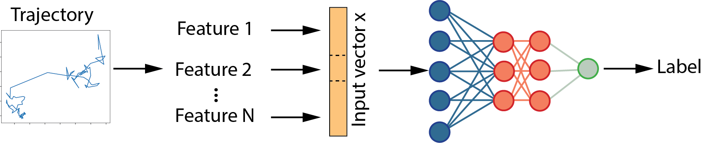

# Trajectory analysis
In this repo we share a method to classify trajectories based on a set of pre-defined features of the trajectory, e.g. Q-meausure, convex Hull, distribution of distance travelled per step. This simple classification algorithm can be applied to characterize ergodic vs. non-ergodic trajectories, or more detailed classifications such as continuous time random walk , levy walk etc. (See a more detailed descriptiom below. While this repo mainly focusses on classification, we have also started working on estimating the the anomolous exponent of the trajectories (this is still under construction) 

This work is inspired by the ANDI challenge which main aim is 
at bringing together a vibrating and multidisciplinary community of scientists working on this problem. The use of the same reference datasets will allow an unbiased assessment of the performance of published and unpublished methods for characterizing anomalous diffusion from single trajectories.
https://competitions.codalab.org/competitions/23601#learn_the_details-the-andi-workshop

The main three tasks are:
Task 1 - Inference of the anomalous diffusion exponent α.
Task 2 - Classification of the diffusion model.
Task 3 - Segmentation of trajectories.

## Neural network architecture 

We use a multi-feature neural network with N different features that characterize the trajectory and use a simple architecture as described below to perform the classification of the trajectory.  

Both the architecture as well as some predefined features are outlined in the src folder. We provide a simple Jupyter notebook in the notebook folder and, using the ANDI challange code (https://github.com/AnDiChallenge) we wrote a simple notebook to generate trajectories of different lengths. 

## Interpretability of the classification

To help with selecting the relevant features we integrate the model interpretability library Captum (https://github.com/pytorch/captum) to calculate the importance of every feature in the classification process. We showcase this in one of the notebooks. 

## Background on trajectories classification 

*Anomalous diffusion* is characterized by the case when MSD proportional to nonlinear growth of t to the power of a (non equal to 1),
and can be generated by a variety of stochastic processes [1]. 
Generally one can identify: 
- normal diffusion (ND), 
- directed motion (DM), motion with a drift, 
- anomalous diffusion (AD),
- confined diffusion (CD).

More specifically one can distinguish then the following types of stochastic processes:
-   the Continuous-Time Random Walk (CTRW);
-   the Fractional Brownian Motion (FBM);
-   the Lévy Walk (LW);
-   the Annealed Transient Time Motion (ATTM);
-   the Scaled Brownian Motion (SBM).

### Types of trajectories 

**A continuous-time random walk (CTRW)** is a generalization of a random walk where the wandering particle waits for a random time between jumps. It is a stochastic jump process with arbitrary distributions of jump lengths $l(x)$ and waiting times $\phi(t)$.

**The Fractional Brownian Motion (FBM)**
  is a generalization of Brownian motion. Unlike classical Brownian motion, the increments of FBM need not be independent and the increment process, $X(t) = B_H(t+1) − B_H(t)$, is known as fractional Gaussian noise, where $H$ is Hurst exponent.
    
  **Levy walk** is a random walk in which the step-lengths have a probability distribution that is heavy-tailed: $Pr(x<L)\propto [1:x<1] [x^{D}:x>1]$, where $D$ is Pareto distribution parameter.   Another way to look at  Levy Walk is as a Coupled CTRW. 

**Scaled Brownian motion** is a simple model of anomalous diffusion, in which the diffusion coefficient varies with time as $D(t) = \alpha D_\alpha t^{\alpha-1}$, $\alpha\in(0,2)$ is scaling exponent, $D_\alpha$ is generalised diffusion coefficient. This is a nonstationary Gaussian process obtained by rescaling Brownian motion $W(t)$: $X(t) =\sqrt{D_\alpha} W(t^{\alpha}).$

**Brownian motion or Wiener process**
In a Brownian time series there is no correlation between the observations and a future observation; a Hurst exponent close to 0.5 is indicative of a Brownian time series. 

**Anti-persistent motion**
 An anti-persistent time series (also known as a mean-reverting series) an increase will most likely be followed by a decrease or vice-versa (i.e., values will tend to revert to a mean). This means that future values have a tendency to return to a long-term mean. A Hurst exponent value between 0 and 0.5 is indicative of anti-persistent behavior and the closer the value is to 0, the stronger is the tendency for the time series to revert to its long-term means value.

**Persistent motion**
For persistent time series an increase in values will most likely be followed by an increase in the short term and a decrease in values will most likely be followed by another decrease in the short term. A Hurst exponent value between 0.5 and 1.0 indicates persistent behavior; the larger the H value the stronger the trend.

### Problem formulation on ergodicity testing for trajectories  

Let us assume that our system in its present state at some time t_0, while our measurement started at some later instant of time. Then the system possesses *no age*, if 
| x(t_2 - t_0) -x(t_1-t_0)|^2 = K(t_2-t_1)
or in words, whenever we start our measurement on a process, the result of this measurement only depends on the time-lag between the measurement points denoted here as K. 

### Additional properties of trajectories 

 **Hurst exponent** is defined through asymptotic behaviour of the rescaled range as a function of the time span of a time series.

**The main general challenge** for analysis trajectories is often limited especially for trajectories that are short, irregularly sampled or featuring mixed behaviors.

**Ergodicity breaking tests** 
There are various ergodicity breaking tests, one of them was developed in [2]. 
The main idea of ergodicity breaking and mixing estimators are based on time-averaged characteristic function of increments and Khinchins theorem about relation between ergodicity and long-time vanishing velocity of autocorrelation function of stationary process (as null model of ergodic system).

**MSD vs. TAMSD properties of trajectories**
In statistical mechanics, the mean squared displacement (MSD) is a measure of the deviation of the position of a particle with respect to a reference position over time. It is the most common measure of the spatial extent of random motion, and can be thought of as measuring the portion of the system "explored" by the random walker.  Another possible alternative to MSD is time-averaged MSD or TAMSD.

**Hurst exponent**

In simple words, the Hurst exponent is used as a measure of the long-term memory of a time series. (Adapted from http://analytics-magazine.org/the-hurst-exponent-predictability-of-time-series/) Using the Hurst exponent we can classify time series into types and gain some insight into their dynamics. Here are some types of time series and the Hurst exponents associated with each of them.

##  How to use this repository 

The main notebook for interpretations of features are here:
https://github.com/Liyubov/Trajectory_analysis/blob/main/notebooks/FFNN_Interpret-features-research.ipynb

https://github.com/remykusters/Trajectory_analysis/blob/main/notebooks/FFNN_Interpret.ipynb

In this notebook (on other branch) we use other methods for interpreting features: 
https://github.com/Liyubov/Trajectory_analysis/blob/main/notebooks/LSTM_MultipleFeatures_batched.ipynb

[1] R. Metzler et al. "Anomalous diffusion models and their properties: non-stationarity, non-ergodicity, and ageing at the centenary of single particle tracking"  https://pubs.rsc.org/en/content/articlelanding/2014/cp/c4cp03465a#!divAbstract 
Phys. Chem. Chem. Phys., 16, 24128-24164  (2014)

[2]  Y. Lanoissele et al. "Revealing nonergodic dynamics in living cells from a single particle trajectory" Phys.Rev. E, (2016) 
